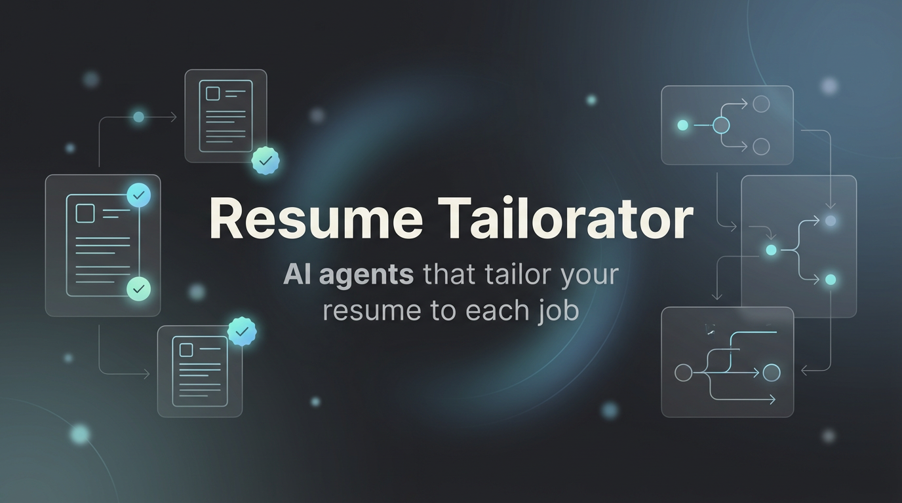

#  📄 Resume Tailorator



Resume Tailorator is a sophisticated multi-agent AI system designed to analyze job postings and tailor your resume to match specific job requirements. It ensures authenticity, avoids AI clichés, and optimizes for Applicant Tracking Systems (ATS).

## 🚀 Features

- **Multi-Agent Architecture**: Uses specialized agents for analyzing, writing, and auditing.
- **Automated Job Analysis**: Extracts key requirements and skills from job postings.
- **Resume Memory**: Stores your original resume plus job-specific tailored outputs in SQLite.
- **Authentic Tailoring**: Rephrases your experience to match the job without inventing skills.
- **Hallucination & Cliché Detection**: Built-in auditor to ensure quality and "human" tone.
- **Dual Output**: Generates both Markdown (`.md`) and PDF (`.pdf`) versions of the tailored resume.
- **Input Validation**: Ensures your input files are correctly formatted before processing.
- **Self-Correcting Workflow**: The writer agent iterates based on feedback from the auditor.

## 🛠️ Architecture

The system employs a sequential pipeline of AI agents:

1.  **Analyst Agent**: Extracts structured job requirements.
2.  **Resume Parser Agent**: Parses your Markdown resume into structured data.
3.  **Writer Agent**: Tailors the CV to match job requirements.
4.  **Auditor Agent**: Validates for hallucinations and AI clichés.
5.  **Reviewer Agent**: Provides quality feedback.

## 📋 Prerequisites

- **Python 3.13+**
- **[uv](https://github.com/astral-sh/uv)** (Fast Python package installer and resolver)
- **OpenAI API Key** (or compatible LLM provider configured in environment)

## 📦 Installation

1.  **Clone the repository**:
    ```bash
    git clone https://github.com/EmadMokhtar/resume_tailorator
    cd resume_tailorator
    ```

2.  **Install dependencies**:
    This project uses `uv` for dependency management.
    ```bash
    uv sync
    ```

3.  **Set up Environment Variables**:
    Export your OpenAI API key (or other provider keys):
    ```bash
    export OPENAI_API_KEY=your_api_key_here
    ```

## 🏃 Usage

1.  **Prepare Input Files**:
    Navigate to the `files/` directory and update:
    *   `job_posting.md`: Paste the job description you want to apply for.

    *Note: Do not leave the default placeholder text in the file.*

2.  **Import your original resume on the first run**:
    Provide the path to your Markdown resume:
    ```bash
    make run RESUME_PATH=/absolute/path/to/resume.md
    ```

3.  **Run later submissions**:
    Reuse the latest stored original resume:
    ```bash
    make run
    ```

    Switch to a different original resume whenever needed:
    ```bash
    make run RESUME_PATH=/absolute/path/to/updated_resume.md
    ```

4.  **View Results**:
    Upon successful completion, the tailored resume will be saved in the `files/` directory:
    *   `tailored_resume_<Company_Name>.md`
    *   `tailored_resume_<Company_Name>.pdf`

## 🧠 Resume Memory Behavior

- The first run requires `RESUME_PATH` so the CLI can store your original resume.
- If you omit `RESUME_PATH` later, the CLI reuses the latest stored original resume.
- The system reparses the original resume only when its content changes or the parser version changes.
- Every job submission starts from the original resume, never from a previous tailored resume.
- Each successful tailoring run stores the tailored resume and audit result linked back to the original source resume.
- The local memory database lives at `files/resume_memory.sqlite3`.

## 🛠️ Make Commands

This project uses a `Makefile` to simplify common tasks. Here are the available commands:

| Command            | Description                                                     |
|--------------------|-----------------------------------------------------------------|
| `make help`        | Show available commands and descriptions.                       |
| `make install`     | Install production dependencies using `uv`.                     |
| `make install/dev` | Install development dependencies using `uv`.                    |
| `make run`         | Validate inputs and run the workflow using the latest original resume. |
| `make run RESUME_PATH=/path/to/resume.md` | Import or switch the original resume for the run. |
| `make install/uv`  | Ensure `uv` is installed (automatically run by other commands). |

## 📂 Project Structure

```
resume_tailorator/
├── files/                  # Input and output files
│   ├── job_posting.md      # Target job description
│   └── resume_memory.sqlite3  # Local original/tailored resume memory
├── models/                 # Pydantic data models
├── memory/                 # Resume memory models, service, and repositories
├── tools/                  # Helper tools (Playwright, etc.)
├── utils/                  # Utilities (PDF generation, validation)
├── workflows/              # Agent definitions and workflow logic
├── main.py                 # Entry point
├── Makefile                # Command shortcuts
└── pyproject.toml          # Project configuration
```

## 🛡️ Safety & Quality

- **Anti-Hallucination**: The system is strictly instructed never to invent skills or experiences.
- **Cliché Filter**: Avoids terms like "spearheaded", "synergy", and "game-changer".
- **Validation**: The `make run` command checks the job posting and, when provided, the resume path before starting the expensive AI process.

## 🤝 Contributing

Contributions are welcome! Please ensure you follow the coding guidelines and add tests for new features.
